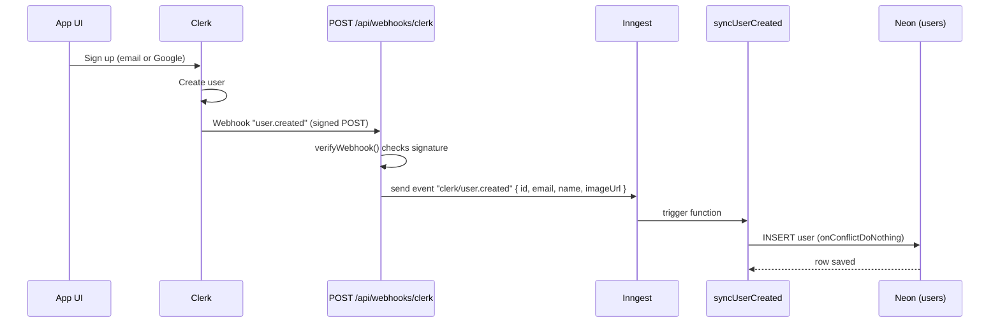

# How auth data flows from the UI to the Neon database

A reference for future-me. It explains, step by step, how a new user who signs
up in the app ends up as a row in the Neon `users` table.

Short version: the app never writes the user to the database directly. Clerk
tells our backend "a user was created", our backend hands that off to a
background job (Inngest), and the job writes the row. This keeps the webhook
fast and gives us automatic retries if the database write fails.

---

## The big picture

```text
┌─────────────┐   sign up / sign in    ┌─────────────┐
│  App UI      │ ─────────────────────► │   Clerk      │  (creates the user,
│ (sign-up,    │                        │  (auth SaaS) │   stores email, name…)
│  Google SSO) │                        └──────┬──────┘
└─────────────┘                               │
                                              │  webhook: "user.created"
                                              │  (HTTP POST, signed)
                                              ▼
                        ┌──────────────────────────────────────┐
                        │  POST /api/webhooks/clerk             │  ← our server
                        │  1. verify the signature              │    (Expo Router
                        │  2. pick out id, email, name, image   │     API route)
                        │  3. send an Inngest event             │
                        └──────────────────┬───────────────────┘
                                           │  event: "clerk/user.created"
                                           ▼
                        ┌──────────────────────────────────────┐
                        │  Inngest  (background job runner)      │
                        │  runs the function "syncUserCreated"   │
                        └──────────────────┬───────────────────┘
                                           │  INSERT (via Drizzle ORM)
                                           ▼
                                 ┌───────────────────┐
                                 │  Neon Postgres     │
                                 │  users table       │
                                 └───────────────────┘
```

Same flow as a Mermaid diagram (renders on GitHub):



---

## Why go through Inngest instead of inserting directly?

- **Speed:** the webhook only enqueues an event, then answers Clerk with `200`
  right away. Clerk does not wait for the database.
- **Reliability:** if the database write fails, Inngest retries the job on its
  own. A plain webhook would just drop the request.
- **Idempotency:** Clerk can send the same webhook more than once. The insert
  uses `onConflictDoNothing`, so a repeat never creates a duplicate or an error.

---

## All three user events

The same pattern (webhook → verify → Inngest event → DB write) handles the whole
user lifecycle. Subscribe to all three in the Clerk Dashboard.

| Clerk webhook | Inngest event | Job | Database write |
|---|---|---|---|
| `user.created` | `clerk/user.created` | `syncUserCreated` | `INSERT` (skip if the row already exists) |
| `user.updated` | `clerk/user.updated` | `syncUserUpdated` | Upsert: update email/name/image and bump `updated_at` (insert if missing) |
| `user.deleted` | `clerk/user.deleted` | `syncUserDeleted` | `DELETE` the row |

Each write is safe to repeat: insert skips duplicates, upsert overwrites, and
deleting a missing row does nothing. So Clerk re-deliveries and Inngest retries
never cause errors. For `user.deleted`, Clerk sends only the `id`.

## The files involved

| File | Job |
|---|---|
| `src/app/(auth)/sign-up.tsx`, `sign-in.tsx`, `welcome.tsx` | The UI. Uses Clerk (`@clerk/expo`) for email and Google sign-in. |
| `src/app/api/webhooks/clerk+api.ts` | Receives Clerk's `user.created` / `user.updated` / `user.deleted` webhooks, verifies them, sends the matching Inngest event. |
| `src/server/inngest/client.ts` | Creates the one Inngest client (`id: "triply"`). |
| `src/server/inngest/functions.ts` | The user-sync jobs: `syncUserCreated` (insert), `syncUserUpdated` (upsert), `syncUserDeleted` (delete). |
| `src/app/api/inngest+api.ts` | The endpoint Inngest calls to run our functions (`serve` from `inngest/edge`). |
| `src/server/db/schema.ts` | The `users` table definition (Drizzle). |
| `src/server/db/index.ts` | The database client (Drizzle over the Neon `neon-http` driver). |
| `drizzle.config.ts` | Config for `drizzle-kit` (used by `npm run db:push`). |

---

## How the data changes shape along the way

**1. Clerk's raw webhook payload** (many fields) — the parts we use:

```jsonc
{
  "type": "user.created",
  "data": {
    "id": "user_2abc…",
    "email_addresses": [{ "id": "idn_1", "email_address": "jane@example.com" }],
    "primary_email_address_id": "idn_1",
    "first_name": "Jane",
    "last_name": "Doe",
    "image_url": "https://img.clerk.com/…"
  }
}
```

**2. The flat event we send to Inngest** (`clerk/user.created`) — only what the
insert needs:

```jsonc
{
  "id": "user_2abc…",
  "email": "jane@example.com",   // primary email, else the first one
  "name": "Jane Doe",            // first + last, or null
  "imageUrl": "https://…"        // or null
}
```

**3. The row written to Neon** (`users` table):

| id | email | name | image_url | created_at | updated_at |
|---|---|---|---|---|---|
| user_2abc… | jane@example.com | Jane Doe | https://… | (now) | (now) |

`id` is the **Clerk user id** used directly as the primary key, so we never
store a second id. `updated_at` refreshes on any later update (for example a
future `user.updated` webhook).

---

## Environment variables it depends on

Client (safe to bundle, `EXPO_PUBLIC_` prefix):
- `EXPO_PUBLIC_CLERK_PUBLISHABLE_KEY` — lets the app talk to Clerk.

Server only (no prefix — never expose these):
- `CLERK_WEBHOOK_SIGNING_SECRET` — used by `verifyWebhook` to prove the webhook
  really came from Clerk.
- `DATABASE_URL` — the Neon connection string (HTTP).
- `INNGEST_DEV=1` — in development only. Makes the Inngest SDK use the local dev
  server, so no Inngest keys are needed.

In production you also add `CLERK_SECRET_KEY`, `INNGEST_EVENT_KEY`, and
`INNGEST_SIGNING_KEY`. See `.env.example`.

---

## Running it locally (development)

You need three long-running terminals plus one browser setup. (These are
developer-run — see `AGENTS.md`.)

1. **Once — create the table in Neon:**
   ```sh
   npm run db:push
   ```
2. **Expo dev server** (serves the API routes). This is usually already running:
   ```sh
   npm run start
   ```
   Note: `app.json` must have `web.output: "server"`, or the `+api.ts` routes do
   not run. Restart Expo after changing that.
3. **Inngest dev server** (runs the background job):
   ```sh
   npm run inngest:dev
   ```
   Wait for it to say **"apps synced"** — that means it found our
   `/api/inngest` endpoint and registered the user-sync functions
   (`syncUserCreated`, `syncUserUpdated`, `syncUserDeleted`).
4. **ngrok** (gives Clerk a public URL to reach your laptop):
   ```sh
   npm run tunnel
   ```
   Copy the `https://…ngrok-free.app` URL (also visible at
   http://127.0.0.1:4040, which shows every request live).
5. **Clerk Dashboard → Webhooks → Add Endpoint:**
   - URL: `https://<ngrok-url>/api/webhooks/clerk`
   - Subscribe to `user.created`, `user.updated`, and `user.deleted`.
   - Make sure its Signing Secret matches `CLERK_WEBHOOK_SIGNING_SECRET`.

Then sign up a user (or use Clerk's **Testing** tab) and watch the row appear.

---

## How to test each part on its own

The chain has two halves. Test them separately to find any problem fast.

- **Database half (Inngest → Neon), no Clerk/ngrok needed:** open the Inngest
  dashboard (http://localhost:8288) → **Send test event** → name
  `clerk/user.created`, data `{ "id": "user_test_1", "email": "t@t.com",
  "name": "Test", "imageUrl": null }`. A row should appear in Neon.
- **Webhook half (Clerk → our server):** use the **Testing** tab on the Clerk
  webhook page. Watch the request return `200` in the ngrok inspector (4040).

Where to look when a user does **not** appear:
- **ngrok 4040** — did the POST arrive? What status came back?
  - No request → Clerk endpoint URL or subscription is wrong.
  - `400` → signature failed (wrong `CLERK_WEBHOOK_SIGNING_SECRET`).
  - `500` → error inside the handler (check the Expo terminal).
  - `200` → the webhook worked; look further down.
- **Inngest 8288 → Runs** — is there a `sync-user-created` run? If it failed,
  open it to read the error (for example a database problem).
- **Neon `users` table** — refresh it; the row should be there.

---

## Production differences (later)

- The backend deploys to **EAS Hosting (Cloudflare Workers)**, so the webhook
  URL becomes the deployed `https://<app>.expo.app/api/webhooks/clerk` instead
  of ngrok. All server code stays web-standard (no Node built-ins) for that
  reason.
- Inngest runs in the cloud: set `INNGEST_EVENT_KEY` and `INNGEST_SIGNING_KEY`,
  remove `INNGEST_DEV`, and sync the app URL in Inngest Cloud.
- Use `npm run db:generate` to create versioned SQL migrations instead of
  `db:push`.

---

## Gotchas we already hit (so future-me does not repeat them)

- **`web.output` must be `"server"`** in `app.json`, and Expo must be restarted
  after changing it, or `/api/*` routes return nothing.
- **0 rows but the test event works** → the Clerk→server half is not connected
  (ngrok not running, or the Clerk webhook endpoint not set up).
- **ngrok "agent too old" (`ERR_NGROK_121`)** → the account needs agent
  ≥ 3.20.0. Update with `ngrok update` (winget's package can be outdated).
- **ngrok config "unknown version"** → the `ngrok.yml` format version did not
  match the installed ngrok. Re-run `ngrok config add-authtoken <token>` with
  the current binary to rewrite it.
